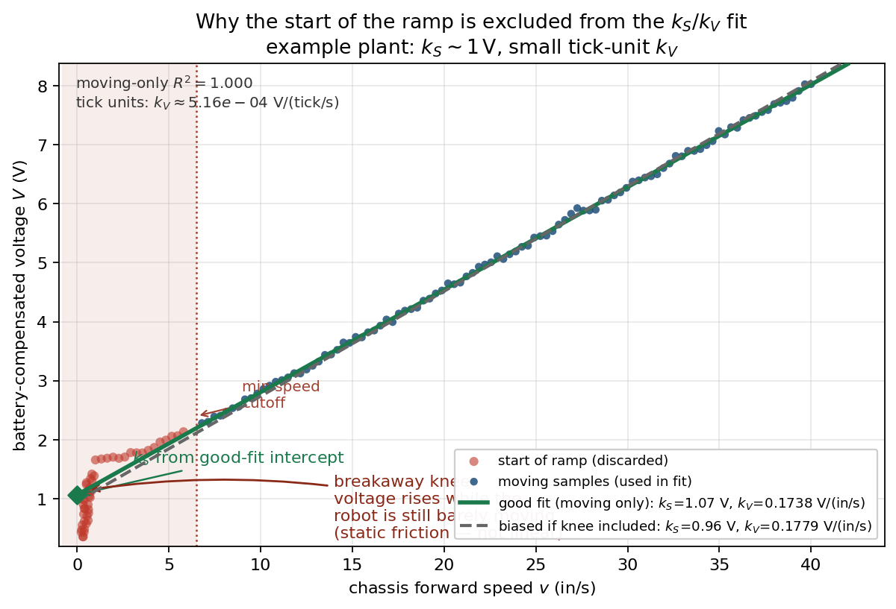
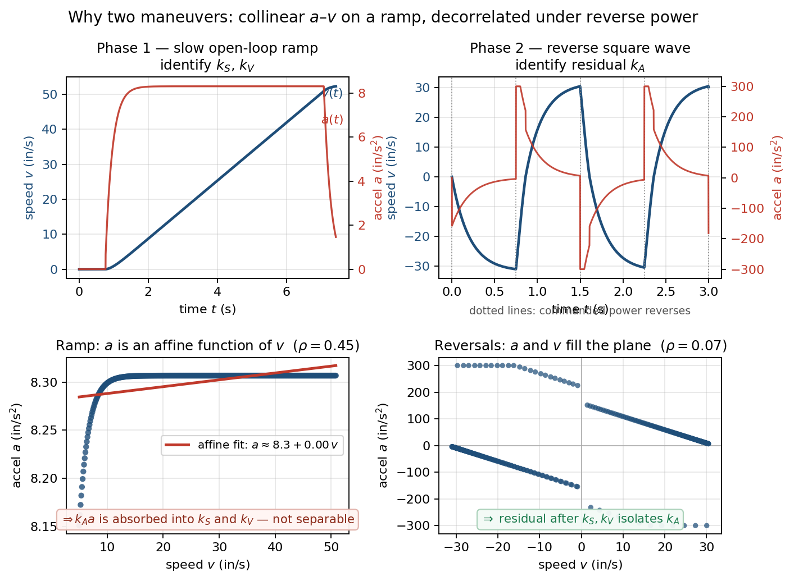

# Plant Model and Identification

This is the *why* companion to the [automated tuning flow](tuning.md). That guide says
**which OpMode to run.** This one answers:

- What do numbers like $k_S$, $k_V$, and $k_A$ *mean*?
- Why does Road Runner need them?
- Why do we run the steps in that order?

**Big idea in one sentence:** most of what people call “tuning” is really
**measuring how *your* robot behaves**, then putting those measurements into a simple
math model so the software can plan and drive accurately.

You already know the physics pieces: friction, inertia, motors that make less torque as
they spin faster (back-EMF). We package that into three constants and a few geometry
numbers. Feedback (the “gains”) only cleans up whatever the model got wrong.

---

## Glossary (quick)

| Word | Plain meaning here |
|------|--------------------|
| **Plant** | The real physical system — the robot — and our math model of it |
| **Identify** | Measure constants from data (fit a line, etc.), not pick them by feel |
| **Feedforward (FF)** | Compute the voltage the model says you *should* need, *before* looking at error |
| **Feedback** | Correct leftover error (PID-style gains on pose / velocity) |
| **Localization** | Estimating where the robot is (encoders, Pinpoint, OTOS, …) |
| **Regression / fit** | Best line (or curve) through a cloud of data points |

---

## 1. “Tuning” vs measuring

| People say… | What you should think… |
|-------------|-------------------------|
| “Tune $k_S$ / $k_V$ / $k_A$” | **Measure** the drivetrain’s voltage model |
| “Tune track width” | **Measure** effective width between wheels (for the drive math) |
| “Tune lateral constants” | **Measure** strafe plant — mostly a **higher $k_S$** (friction); $k_V$/$k_A$ often similar |
| “Tune gains” | **Choose** how aggressive the correction loop is — on top of a good model |

$k_S$, $k_V$, and $k_A$ are **properties of the robot and floor**, not taste settings.

- Heavier robot $\rightarrow$ often larger $k_A$ (more inertia).
- Sticky carpet $\rightarrow$ often larger $k_S$ (more friction).
- Different motors or gearing $\rightarrow$ different $k_V$.

You do **not** “prefer a higher $k_V$.” You run the experiment, read the fit, and put that
number in the code. If the fit looks wrong, fix the **experiment** (encoder sign, wall
hits in the data, units) — don’t invent a prettier constant.

Gains *are* a choice (“how snappy do we want the loop?”), but even they are mostly
**computed from the plant** once you pick a target “how fast should the loop respond?”
The automated gain OpMode searches **one** knob (bandwidth), not six random numbers.

---

## 2. Why Road Runner needs these numbers

Road Runner does three jobs. All three need the same answer to:

> If I want this speed and acceleration, **about how many volts** should each motor get?

### 2.1 Following a path (feedforward)

The follower is **not** “only PID to the pose.” Each control cycle it roughly asks:

1. Where should the robot be right now, and with what speed / accel?
2. What wheel speeds does that require? (geometry / kinematics)
3. What **voltage** should produce those wheel speeds? (**plant model**)

That voltage model is:

$$
V = k_S \cdot \mathop{\text{sign}}(v) + k_V \cdot v + k_A \cdot a
$$

| Symbol | Meaning |
|--------|---------|
| $V$ | Voltage we command (after battery compensation) |
| $v$ | Speed (wheel or chassis, in the units used when fitting) |
| $a$ | Acceleration (same unit system) |
| $\mathop{\text{sign}}(v)$ | $+1$ if moving forward, $-1$ if reverse, $0$ if stopped |

**Intuition:**

- $k_S$ — “tax to keep moving” (friction). Even at low speed you need some voltage.
- $k_V$ — “harder as you go faster” (back-EMF + viscous drag). Cruise needs more volts.
- $k_A$ — “extra push to speed up or slow down” (inertia).

The code then divides by the **live battery voltage** so a dying pack still maps “model
volts” to motor power correctly.

If the model is good, open-loop following of a smooth path is already close. Feedback
only fixes leftovers (bumps, model error). If the model is bad, feedback fights a large
mistake every cycle — that feels like lag, oscillation, or “gains that never work.”

### 2.2 Planning the path (speed limits)

Before you drive, the planner builds a **time schedule**: how fast to go along the path
so you don’t ask for impossible wheel speeds or accelerations.

- Simple approach: hard-coded max speed / accel (safe but often slow or sometimes too
  optimistic).
- Smarter approach (optional voltage constraint): **flip the plant equation.** Given
  “we only have about $11\,\mathrm{V}$ of budget,” what $(v, a)$ pairs stay legal?

So a good plant doesn’t only improve following — it can make **planned paths** more
honest. Identify the plant *before* trusting voltage-based limits.

### 2.3 Choosing feedback gains

After feedforward cancels most of the hard physics, what’s left behaves a bit like a
system with one important time scale:

$$
\tau = \frac{k_A}{k_V}
$$

($\tau$ is larger when the robot is “heavier” relative to how strongly speed produces
drag / back-EMF.)

If you pick a desired response speed $\omega_n$ (bandwidth) and damping $\zeta$, you can
**compute** position and velocity gains instead of guessing:

$$
k_p = \omega_n^2 \cdot \tau, \qquad
k_d = \max(0,\; 2\zeta\omega_n\tau - 1).
$$

You don’t need to memorize these formulas to drive. The takeaway is: **$k_S$, $k_V$,
$k_A$ are not “only for feedforward.”** They also make gain selection scientific instead
of folklore.

---

## 3. Three layers (build the house from the foundation)

Each layer depends on the one below it.

```
┌─────────────────────────────────────────────┐
│  Feedback (gains / how hard we correct)     │  ← cleans up leftovers
├─────────────────────────────────────────────┤
│  Voltage plant (kS, kV, kA, + extras)       │  ← “how many volts?”
├─────────────────────────────────────────────┤
│  Geometry & localization (scales, offsets)  │  ← “what is an inch? which way is +x?”
└─────────────────────────────────────────────┘
```

**Analogy:** Layer A is your **ruler and coordinate grid**. Layer B is the **recipe** for
voltage. Layer C is **seasoning** — useless if the recipe and ruler are wrong.

### Layer A — Geometry and localization

Almost pure measurement of the chassis and sensors:

| Quantity | What it answers |
|----------|-----------------|
| Motor / encoder **directions** | Does “forward” increase $+x$ in software? |
| `inPerTick` | How many inches is one encoder tick? |
| Odometry / Pinpoint **offsets** | Where are the sensors relative to the robot center? |
| `trackWidthTicks` | Effective left–right wheel spacing for **drive math** (and, on some setups, for estimating heading) |

If the ruler is wrong, every “speed” sample is wrong, and every later fit is garbage.
That’s why the [tuning flow](tuning.md) starts with directions and scale: **calibrate the
ruler before you do science.**

**Pinpoint / OTOS note.** Those devices measure heading themselves, so
`trackWidthTicks` is *not* how pose heading is estimated. It still matters for the
**drive model**: “how much wheel speed should a turn command use?” Treat it as a measured
effective width (rollers scrub), not a free gain you crank for fun.

### Layer B — Voltage plant (forward / axial)

| Term | Physics picture | Typical size (mecanum-ish drivetrain) |
|------|-----------------|----------------------------------------|
| $k_S$ | Friction “cover charge” | often about $1\,\mathrm{V}$ |
| $k_V$ | Extra volts per unit speed | small in tick units (often $\sim 10^{-4}$) — scientific notation in telemetry is normal |
| $k_A$ | Extra volts per unit accel | also small in tick units |

**Constant-speed picture.** When you’re not accelerating much:

$$
V \approx k_S \cdot \mathop{\text{sign}}(v) + k_V \cdot v
$$

That’s a **straight line** if you plot voltage $V$ against speed $v$:

- intercept $\approx k_S$
- slope $\approx k_V$

So a slow open-loop **ramp** (gradually increase power, log $v$ and $V$) is just
“collect points and fit a line.” You are **reading** $k_S$ and $k_V$ off the data.



**Why throw away the start of the ramp?** At the very beginning, **static friction**
still holds the robot. Voltage climbs while speed stays near zero. On the plot that is a
**near-vertical knee** — not the straight “already rolling” line. If you leave those
points in, the fit for $k_S$ and $k_V$ gets biased (dashed line). The tuner keeps only
samples above a minimum speed so it sees free rolling. (Same idea as stock
`ForwardRampLogger`.)

The cloud’s noise in the figure is synthetic; the **intercept and slope are scaled to
representative mecanum plant values** (roughly $1\,\mathrm{V}$ of $k_S$ and a small
tick-unit $k_V$). On the robot, the axial feedforward tuner does this fit and stores
$k_V$ in **tick units** in Params.

#### Why two maneuvers? (ramp, then reverse)

The full model includes acceleration:

$$
V = k_S \mathop{\text{sign}}(v) + k_V v + k_A a.
$$

On a *slow* ramp, $a$ and $v$ rise in a related way — roughly, $a$ is an **affine**
function of $v$ (a line: $a \approx c_0 + c_1 v$). Then the $k_A a$ term looks like a
shift of $k_S$ and $k_V$. One fit cannot separate all three.

So the procedure is:

1. **Ramp** — fit $k_S$ and $k_V$ from $V$ vs $v$ (ignore $k_A$ for a moment).
2. **Reverse square wave** — flip drive direction several times. Now the same speeds
   appear with **both** speeding up and slowing down. $a$ is no longer glued to $v$.
   Hold $k_S$ and $k_V$ fixed; the leftover voltage vs change in speed reveals $k_A$.

(The code uses an integrated form so it doesn’t need a noisy numerical derivative for
$a$.)



**Left column:** ramp — $a$ vs $v$ lies near a line $\Rightarrow$ $k_A$ is mixed into the
other terms. **Right column:** reversals — $a$ vs $v$ fills the plane $\Rightarrow$ you
can isolate $k_A$. That is why the axial (and lateral) tuners are **two phases**, not one
long ramp. More detail on lateral / yaw extras:
[feedforward and constraints](feedforward-and-constraints.md).

### Layer C — Feedback

Only after Layer B is believable do you set gains. Feedforward already paid for most of
friction, cruise, and accel. The loop only needs enough “stiffness” to correct error
without ringing.

If you need gigantic gains to “push through” lag, the model or localization is probably
wrong — not “you haven’t turned kP up enough.”

---

## 4. How the plant is used while driving

### Feedforward (every loop)

$$
V_{\mathrm{ff}} = k_S\mathop{\text{sign}}(v) + k_V v + k_A a
$$

then roughly

$$
\text{motor power} \approx \frac{V_{\mathrm{ff}}}{V_{\mathrm{battery}}}.
$$

- Good $k_S$ $\rightarrow$ less stuck / laggy starts  
- Good $k_V$ $\rightarrow$ right cruise speed for a given command  
- Good $k_A$ $\rightarrow$ better accel and braking  

### Planning

- Default: fixed max wheel speed and accel caps.  
- Optional voltage limit: use the plant so the path never asks for more volts than you
  have. **Better identification $\rightarrow$ better paths.**

### Gains

$\tau = k_A / k_V$ tells the gain calculator how “sluggish” the leftover plant is.
`FeedbackGainTuner` will not run without positive $k_V$ and $k_A$ — without $\tau$ it
has no model to design against.

---

## 5. Why the order of OpModes matters

The [step table in the tuning guide](tuning.md) is a **dependency chain**, not a
random checklist.

| Order | What you measure | Why the next steps need it |
|-------|------------------|----------------------------|
| 1 | Motor / encoder directions | Signs of speed and pose must match the math |
| 2 | Linear scale (`inPerTick`) | Turns ticks into inches for all rates |
| 3 | Angular / odometry geometry | Pose (and sometimes heading) make sense |
| 4 | Axial $k_S$, $k_V$, $k_A$ | Core plant for drive, later tests, gains |
| 5 | Effective track width | Spin test *uses* the plant; measures turn geometry |
| 6 | Lateral plant (mecanum) | Strafe has **different friction** (and slightly different $k_V$/$k_A$) than forward |
| 7 | Yaw coupling | Sideways curl while going straight; uses $k_V$ and track |
| 8 | Feedback gains | Built from $\tau$; tested with full feedforward on |
| 9 | Verification | Human check: does the whole stack feel right? |

**Common traps:**

- Track-width spin needs feedforward first (especially $k_V$).
- Yaw-coupling math uses $k_V$ and track width.
- Gain synthesis needs $k_A / k_V$.
- Voltage path limits need real positive $k_V$ and $k_A$.

**Chaining OpModes.** Successful automatic fits write into live `PARAMS` for the rest of
that robot-controller session, so you can go to the next OpMode without pasting mid-
session. Paste into source (or use **Show Drive Params** under the Utility menu) before
you restart or redeploy — memory is not a season-long save file.

---

## 6. Optional extras (same idea, more axes)

Some setups add refined feedforward terms beyond stock axial $k_S$/$k_V$/$k_A$. See
[feedforward and constraints](feedforward-and-constraints.md) when those features are
present.

**Anisotropic mecanum.** Strafing scrubs the rollers, so the plant is not the same as
driving forward. Measure a second triple on pure strafe.

**Main finding on real mecanum chassis:** **$k_S$ is the big change** — often about
**$2\times$** the axial value, because sideways motion pays a much higher friction
“cover charge.” **$k_V$ and $k_A$ usually change only a little** (same motors and
similar effective inertia once the robot is already sliding). If your lateral fit shows
$k_S \approx$ axial $k_S$, suspect the strafe experiment; if lateral $k_V$ is *much*
larger with a bad ramp $R^2$, suspect scale or a stuck ramp — not “strafe needs double
back-EMF.”

**Yaw coupling.** Commanded “go straight” often slowly curls. That bias grows with
speed. Measure it on a ramp, cancel it with a small yaw voltage in feedforward so heading
feedback has less work.

Still identification — not “style.” If curl gets *worse* after you paste values, the
sign or scaling is wrong; fix the model.

---

## 7. What “good” looks like

**Fits**

- $k_S$ is usually on the order of **a volt**, not $10^{-4}$.
- $k_V$ and $k_A$ in **tick units** often look tiny in decimal form — scientific notation
  ($5.15\times 10^{-4}$) is expected.
- High $R^2$ on the ramp fit is a good sign (points hug the line).
- On mecanum, **lateral $k_S$ is often ~$2\times$ axial $k_S$** (roller scrub / friction).
  Lateral $k_V$ and $k_A$ are often only modestly higher — the headline difference is
  friction, not a totally different motor model.
- After fixing track width, a re-run should show commanded vs actual turn rate slope near
  $1$.

**Driving**

- With solid feedforward, verification OpModes should track without heroic gains.
- Huge gains fighting lag $\rightarrow$ recheck $k_S$ and localization first.
- Oscillation even at the lowest bandwidth $\rightarrow$ often noisy or laggy pose, not
  “more kP will help.”

**When something fails, ask in this order:**

1. **Ruler?** Directions, `inPerTick`, pose sign.  
2. **Plant?** Does feedforward alone roughly do the right thing on a gentle move?  
3. **Gains?** Only then: too hot or too cold?

---

## 8. Takeaways

1. **$k_S$, $k_V$, $k_A$ are a plant model** — for feedforward, path limits, and gain
   math. Measure them; don’t “tune for snappy.”
2. **Geometry first.** A perfect fit on inverted encoders is still wrong.
3. **Feedforward first, feedback second.** Gains hide a bad model only until paths get
   aggressive.
4. **Order matters** because later tests *use* earlier constants.
5. **Extras (strafe, yaw curl)** are the same philosophy on more axes.
6. **Session memory vs source code.** Live `PARAMS` help you chain OpModes; paste (or
   **Show Drive Params**) so values survive restart.

**Next steps**

- Hands-on order of OpModes: [tuning.md](tuning.md)  
- Feedforward extras and path constraints (when used):
  [feedforward-and-constraints.md](feedforward-and-constraints.md)
